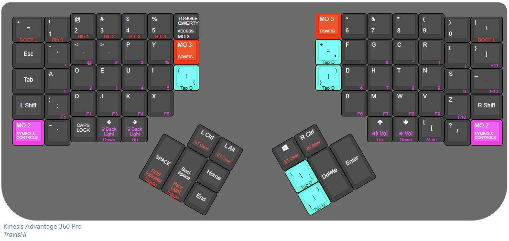

# About this keymap
After using a moonlander for a while, Ive been able to experiment quickly with Oryx. This map is the result.
<br/>
<br/>
The guiding principle is to reduce the amount of finger travel required over the course of a dev day.
<br/>
The `middle bottom` keys (`col 7/col 8`, `row 3`), Contain Single Tap for `(`, Press and hold for `{`, and Double tap for `[` and same for closing shortcuts.
<br/>
- Access to `QWERTY` is via `tog 1` (`col 7`, `row 1`),
- Access to `SYMBOLS` is via `mo 2` (`col 1/col 14`, `row 5`),
- Access to `CONFIG` (Danger layout) is hidden in `QWERTY`, via `mo 3` (`col 7`, `row 2` & `col 8`, `row 1`)
<br/>
<br/>



## Layers
- **DVORAK** - default layer (`Tog 1` to swap in and out of Qwerty layer)<br/>
RGB indicator light = None <br/><br/>

- **QWERTY** - `tog 1`,  Layer 1 is to avoid having to rebind software like blender, and houses access to the danger `CONFIG` layer via `Mo 3`. <div style="display: flex; align-items: center;">RGB indicator light = <div style="margin-left: 5px; margin-right: 5px; height: 15px; width: 15px; background-color: white; border-radius: 50%"></div> (white)</div><br/>

- **SYMBOLS** - `mo 2`, Layer 2, contains handy home row access to numbers and media controls, and some non-dangerous keyboard config controls. <div style="display: flex; align-items: center;">RGB indicator light = <div style="margin-left: 5px; margin-right: 5px; height: 15px; width: 15px; background-color: blue; border-radius: 50%"></div> (blue)</div><br/>

- **CONFIG** - `mo 3`,  **Danger layer**, contains keyboard specific keybinds such as handling ZMK Bluetooth profiles, RGB lighting controls and dangerous `BOOTLOADER` keys. This access layer is purposely hidden in the `QWERTY` layer and is intentionally difficult to use to avoid accidentally entering BOOTLOAD or Bluetooth Select mode. <div style="display: flex; align-items: center;">RGB indicator light = <div style="margin-left: 5px; margin-right: 5px; height: 15px; width: 15px; background-color: lightgreen; border-radius: 50%"></div> (green)</div><br/>

### Note:
RGB Indicator colors are not configured by ZMK, they are a feature created by Kinesis.

---

<br/>

## ADV360-PRO-ZMK

The KA360 is built on top of ZMK. Kinesis have implemented their own solution for particular elements of the keyboard, e.g. the Indicator lighting.
 At this time, digging into the ZMK functionality is currently undocumented by Kinesis.
 <br/>

- **General support page:** https://kinesis-ergo.com/support/kb360pro/

- **Firmware installation guide:** https://kinesis-ergo.com/wp-content/uploads/Step-by-Step-Advantage360-Professional-Firmware-Installation-Instructions-KB360-PRO_v11-10-22.pdf

- **User manual:** https://kinesis-ergo.com/wp-content/uploads/Advantage360-ZMK-KB360-PRO-Users-Manual-v10-7-22.pdf

- **Quick guide:** https://kinesis-ergo.com/wp-content/uploads/Advantage360-Professional-QSG-v8-25-22.pdf
<br/>
<br/>

---
## ZMK

https://zmk.dev/docs


If ZMK is too obscure and you just want a keybinding, here is the Kinesis Mapping Gui:

https://kinesiscorporation.github.io/Adv360-Pro-GUI/

### Good forks
- https://github.com/adrienm7/Adv360-Pro-ZMK/tree/main/config

- https://github.com/chandlerc/Adv360-Pro-ZMK/blob/V2.0/config/keymap.json (Dvorak!)

### Useful links
- https://keyboardchecker.com/ (Check your keymap is actually triggering what you expect)
- http://www.keyboard-layout-editor.com/ Image map for keyboard layouts.

---
## K360 Keyboard Keymap template

```
//  *
//  * ,--------------------------------------------------.                                           ,--------------------------------------------------.                      
//  * |        |      |      |      |      |      |      |                                           |      |      |      |      |      |      |        |
//  * |--------+------+------+------+------+------+------|                                           |------+------+------+------+------+------+--------|
//  * |        |      |      |      |      |      |      |                                           |      |      |      |      |      |      |        |
//  * |--------+------+------+------+------+------+------|       ,-----+-----.  ,-----+-----.        |------+------+------+------+------+------+--------|
//  * |        |      |      |      |      |      |      |       |     |     |  |     |     |        |      |      |      |      |      |      |        |
//  * |--------+------+------+------+------+------+------' .-----+-----+-----|  |-----+-----+-----.  '------+------+------+------+------+------+--------|
//  * |        |      |      |      |      |      |        |     |     |     |  |     |     |     |         |      |      |      |      |      |        |
//  * |--------+------+------+------+------+------'        |     |     |-----|  |-----|     |     |         '------+------+------+------+------+--------|
//  * |        |      |      |      |      |               |     |     |     |  |     |     |     |                |      |      |      |      |        |
//  * `--------+------+------+------+------'               `-----+-----+-----'  `-----+-----+-----'                '------+------+------+------+--------'
//  *                       
//  *                        
//  *                       
//  */
//     [_LAYERINDEX] = LAYOUT(
//       _______, _______, _______, _______, _______, _______,                                     _______, _______, _______, _______, _______, _______,
//       _______, _______, _______, _______, _______, _______,                                     _______, _______, _______, _______, _______, _______,
//       _______, _______, _______, _______, _______, _______, _______, _______, _______, _______, _______, _______, _______, _______, _______, _______,
//                                  _______, _______, _______, _______, _______, _______, _______, _______, _______, _______
//     ),
```

---

## Modifying the keymap

[The ZMK documentation](https://zmk.dev/docs) covers both basic and advanced functionality and has a table of OS compatibility for keycodes. Please note that the RGB Underglow, Backlight and Power Management sections are not relevant to the Advantage 360 Pro's custom ZMK fork. For more information see [this note](#note)

There is a web based GUI available for editing the keymap. It is available at https://kinesiscorporation.github.io/Adv360-Pro-GUI. This repository is also compatible with certain other web based ZMK keymap editors however they may have keycodes or behaviours that are not implemented on the 360 Pro and could cause unusual behaviour or build failures. Furthermore changes made on other keymap editors may not be compatible if one goes back to using the Kinesis GUI.

Certain ZMK features (e.g. combos) require knowing the exact key positions in the matrix. They can be found in both image and text format [here](assets/key-positions.md)

## Building the Firmware with GitHub Actions

### Setup

1. Fork this repo.
2. Enable GitHub Actions on your fork.

### Build firmware

1. Push a commit to trigger the build.
2. Download the artifact.

### Flash firmware

Resources can be found on Kinesis.com

https://kinesis-ergo.com/support/kb360pro/#firmware-updates

https://kinesis-ergo.com/support/kb360pro/#manuals


---

## To build Firmware locally using a container

## Note

By default this config repository references [a customised version of ZMK](https://github.com/ReFil/zmk/tree/adv360-z3.5) with Advantage 360 Pro specific functionality and changes over [base ZMK](https://github.com/zmkfirmware/zmk). The Kinesis fork is regularly updated to bring the latest updates and changes from base ZMK however will not always be completely up to date, some features such as new keycodes will not be immediately available on the 360 Pro after they are implemented in base ZMK.

Whilst the Advantage 360 Pro is compatible with base ZMK (The pull request to merge it can be seen [here](https://github.com/zmkfirmware/zmk/pull/1454) if you want to see how to implement it) some of the more advanced features (the indicator RGB leds) will not work, and Kinesis cannot provide customer service for usage of base ZMK. Likewise the ZMK community cannot provide support for either the Kinesis keymap editor, nor any usage of the Kinesis custom fork.

## Other support

Further support resources can be found on Kinesis.com:

If you have changed other files in the `config` directory (such as `config/west.yml`) you will need to execute `make all` to rebuild the Docker image as well as the firmware.
